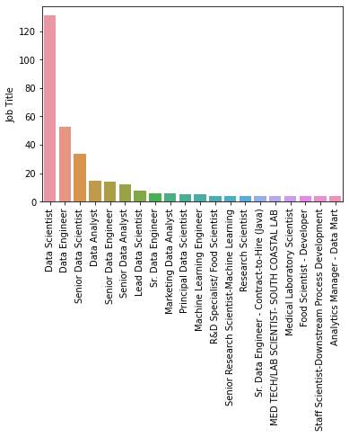

# Salary-Estimator
Created a tool that estimates the expected salaries of various companies to help data scientists to negotiate their income when they are applying for a job.

Data Science Salary Estimator: Project Overview

* Created a tool that estimates data science salaries to help data scientists negotiate their income when they get a job.
* The data was scrapped from glassdoor using python. The data is comprised of the job description and the features of the companies that quantify their values.
* A detailed exploratory analysis helps to find a pattern in the data.
* Optimized Linear, Lasso, and Random Forest Regressors using GridsearchCV to reach the best model.

# Codes And Resources Used
* Python Version: 3.7
* Packages: pandas, numpy, sklearn, matplotlib, seaborn, selenium
* Scraper Github: https://github.com/arapfaik/scraping-glassdoor-selenium
* Scraper Article: https://towardsdatascience.com/selenium-tutorial-scraping-glassdoor-com-in-10-minutes-3d0915c6d905
* Chromedriver 86.0.4240.22 - ChromeDriver is a separate executable that Selenium WebDriver uses to control Chrome.(To view the scraped data in chrome)

# Web Scraping

Tweaked the web scraper github repo (above) to scrape 1000 job postings from glassdoor.com. With each job, we got the following:

* Job title
* Salary Estimate
* Job Description
* Rating
* Company
* Location
* Company Headquarters
* Company Size
* Company Founded Date
* Type of Ownership
* Industry
* Sector
* Revenue
* Competitors

# Data Cleaning

After scraping the data, I needed to clean it up so that it was usable for our model. I made the following changes and created the following variables:

* Parsed numeric data out of salary
* Made columns for employer provided salary and hourly wages
* Removed rows without salary
* Parsed rating out of company text
* Made a new column for company state
* Added a column for if the job was at the company’s headquarters
* Transformed founded date into age of company
* Made columns for if different skills were listed in the job description:
* Python
* R
* Excel
* Spark
* Column for simplified job title and Seniority
* Column for description length

# EDA

I looked at the distributions of the data and the value counts for the various categorical variables. Below are a few highlights from the pivot tables. The EDA also consists of a word cloud as the data contains description of the job profile. 

 

# Model Building

First, I transformed the categorical variables into dummy variables. I also split the data into train and tests sets with a test size of 30%.

I tried three different models and evaluated them using Mean Absolute Error. I chose MAE because it is relatively easy to interpret and outliers aren’t particularly bad in for this type of model.

I tried three different models:

* Multiple Linear Regression – Baseline for the model
* Lasso Regression – Because of the sparse data from the many categorical variables, I thought a normalized regression like lasso would be effective.
* Random Forest – Again, with the sparsity associated with the data, I thought that this would be a good fit.

# Model performance

The Random Forest model far outperformed the other approaches on the test and validation sets.
 

* Random Forest : MAE = 11.265324314015588
* Linear Regression: MAE = 21.317027563078266 
* Lasso Regression: MAE = 22.92976538734676
